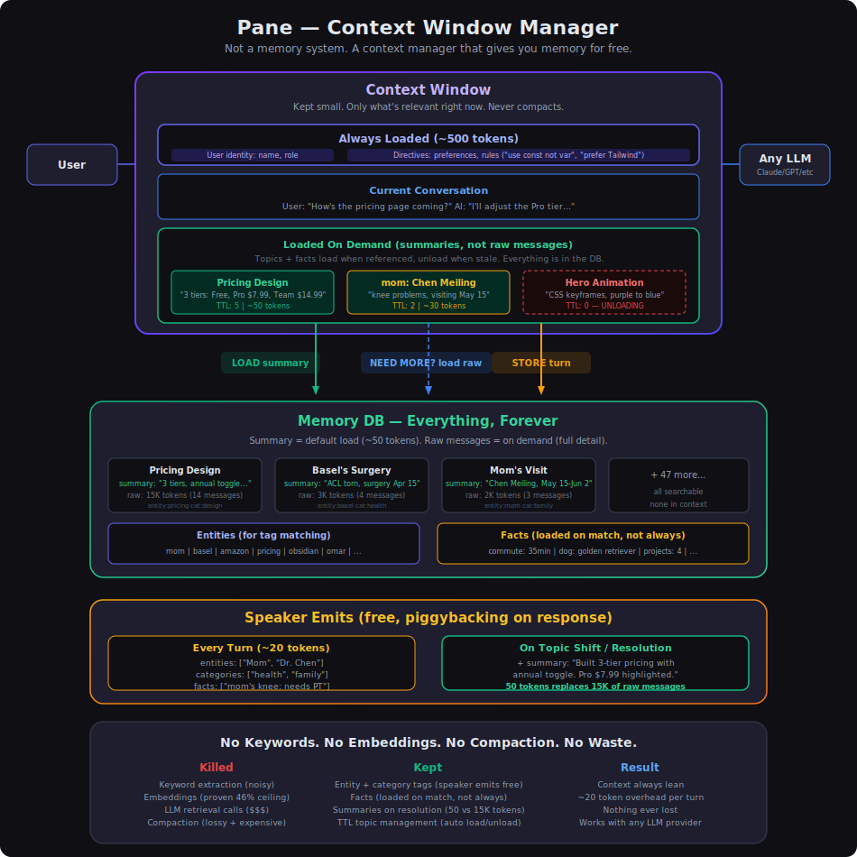

# Pane

Context window manager for LLMs. Memory for free.

**91 tests** | **126/126 eval checks** | **42-82% token savings** | **zero retrieval LLM calls**

## The Problem

LLMs forget everything between sessions. Context windows grow linearly — by turn 50, you're paying for 50 turns of input on every API call, most of it irrelevant. Compaction (summarizing old context) is lossy AND expensive. Every existing memory system adds LLM calls for retrieval, extraction, or both.

## What Pane Does

Pane manages what's in the context window — loading relevant history when needed, unloading stale context when it's not. Nothing is ever lost. Nothing is ever summarized away.

The core insight: **the LLM is already generating a response.** Have it emit a few lines of metadata alongside that response — entities mentioned, facts learned, work type. That metadata costs ~100-200 output tokens per turn and powers a deterministic retrieval system with zero additional LLM calls.

### How it works

```
User sends message
    │
    ▼
[Hook] Search memory DB by entity tags → inject matching context
    │
    ▼
LLM responds + emits metadata (entities, categories, facts)
    │
    ▼
[Hook] Group turn into topic (entity + category fingerprint)
       Store facts, update entity registry
    │
    ▼
Stale subtopics decay via TTL → unload from context
```

### What loads, what unloads

| Layer | Load trigger | Unload trigger |
|---|---|---|
| User facts (name, role, prefs) | Always loaded | Never |
| Entity facts (cpp.exceptions, postgres.downtime) | Entity's topic loaded | All topics with that entity decay to TTL 0 |
| Topic summaries | Entity tag match on user message | TTL countdown (default 5 unreferenced turns) |
| Raw messages | On demand (summary unavailable) | Topic unloads |

### Two-axis topic grouping

Topics are grouped by **entity fingerprint** (what you're working on) and **category fingerprint** (what type of work). This creates natural subtopics:

```
auth-session,cpp  | architecture   ← designing the system
auth-session,cpp  | testing        ← writing tests (SUBTOPIC SPLIT)
admin-dashboard   | debugging      ← different domain entirely (DOMAIN SHIFT)
```

Same entities + same categories → extend the topic. Same entities + different categories → subtopic split. Different entities → new topic. Each subtopic has its own TTL.

### Demo

12 turns through three domains with subtopic shifts. 4 topic rows stored (not 12):

```
+-- Turn 1 ------------------------------------------------
| User: working on auth-session refactor in cpp at acme
|
| [NEW]     fingerprint: auth-session,cpp
|
| [ALWAYS]  user: name=Waleed, role=staff engineer
| [ACTIVE]  auth-session: owner=waleed, status=blocked on review
| [ACTIVE]  cpp: exceptions=disallowed, standard=c++20, style=snake_case
|
| [TOPICS]  [#####] TTL=5  auth-session,cpp

+-- Turn 4 ------------------------------------------------
| User: lets write unit tests for the session handler
|
| [SUBTOPIC]  fingerprint: auth-session,cpp   ← same entities, category shift
|
| [TOPICS]  [#####] TTL=5  auth-session,cpp (testing)
|           [####.] TTL=4  auth-session,cpp (architecture)  ← decaying

+-- Turn 6 ------------------------------------------------   [SWITCH: drop cpp; load python]
| User: actually let me check admin-dashboard in python
|
| [NEW]     fingerprint: admin-dashboard,python   ← domain shift
|
| [ACTIVE]  admin-dashboard: route=/admin, rollout=60%
| [ACTIVE]  python: linter=ruff, version=3.13
|
| [TOPICS]  [#####] TTL=5  admin-dashboard,python
|           [###..] TTL=3  auth-session,cpp (testing)  ← still alive
|           [##...] TTL=2  auth-session,cpp (architecture)  ← decaying

Final inventory:
  auth-session,cpp  | architecture  (3 msgs)  summary: ✓
  auth-session,cpp  | testing       (2 msgs)  summary: ✓
  admin-dashboard   | frontend      (2 msgs)  summary: ✓
  payment-webhook   | database      (4 msgs)  (still open)

  4 topic rows for 11 turns
```

## What's Killed (and why)

| Approach | Finding |
|---|---|
| Embeddings | Proven ceiling — recurring events embed identically, cosine can't distinguish instances |
| Keyword extraction | Noisy — stems from code blocks pollute results |
| LLM retrieval calls | Expensive, slow, adds latency per turn |
| Reranking | Always hurts — narrowing candidates then reranking loses the right answer more than it promotes it |
| Compaction | Lossy AND expensive — clear and reload from DB instead |

## What's Kept (and why)

| Approach | Rationale |
|---|---|
| Entity + category tags | Speaker emits them for free alongside response generation. High precision. |
| Entity-scoped facts | Instant lookup. `cpp.exceptions = "disallowed"` loads when any cpp topic is active. |
| Summaries on topic resolution | 50 tokens replaces 15K of raw conversation. Speaker emits at transition time. |
| TTL-based topic management | Context stays focused automatically. No manual "forget this" needed. |
| Two-axis subtopic grouping | Entity fingerprint + category fingerprint. Splits naturally on work-type shifts. |

## Testing

**91 unit tests** across four modules:
- TTL mechanics (17 tests) — decay, reset, unload-at-zero, mixed scenarios
- Entity facts + active entities (20 tests) — CRUD, scoping, hard-switch, domain-switch scenarios
- Recall + context loading (23 tests) — entity extraction, tag intersection, ranking, token budgets
- Topic grouping (31 tests) — fingerprints, extension, subtopic splits, summary attribution, two-axis overlap

**Tier 1 eval** — speaker compliance (120/120 checks):
Scripted 15-turn conversation validates the speaker emits correct metadata per CLAUDE.md instructions. 8 checks per turn: JSON validity, required fields, entity specificity, category discipline (work types not domain nouns), fact format, summary scaling.

**Tier 2 eval** — end-to-end integration (6/6 checks):
10-turn conversation fed through the real grouping pipeline with a live LLM speaker. Validates: topic row count, subtopic split detection, summary attribution to closing topics, multi-domain separation, entity-fact derivation from loaded topics.

Both tiers run via `python evals/run.py`. Tier 1 gates Tier 2 — if compliance fails, integration doesn't run.

## Quick Start (Claude Code)

```bash
pip install pane-llm
```

Copy `examples/claude-code/` into your project:

```
your-project/
  .claude/
    settings.json          ← hook configuration
    hooks/
      on_message.py        ← recall + TTL + entity fact loading
      on_stop.py           ← topic grouping + fact storage
      on_compact.py        ← re-injects memory after compaction
    memory/                ← runtime data (DB, stats, log)
  CLAUDE.md                ← speaker metadata instructions
```

Then use Claude Code normally. Memory builds silently.

Inspect the DB anytime:
```bash
python scripts/inspect_db.py .claude/memory/pane.db --facts --stats
```

## Research

Built through systematic experimentation (V5–V11) across retrieval approaches. Each version had a thesis, an experiment, and a quantitative result:

- **Model quality > retrieval algorithm.** A better LLM reading raw content beats clever retrieval with a weaker model.
- **Embeddings have a structural ceiling.** Recurring events (e.g. weekly team meetings) embed identically. Cosine similarity scores 0.64–0.65 regardless of which instance. Caps retrieval at ~46%.
- **Reranking always hurts.** Every reranking strategy tested (BM25, cross-encoder, LLM-as-judge) reduced accuracy vs. the raw candidate set.
- **Entity extraction at the wrong abstraction level hurts.** Batch-extracted entities from conversation logs performed worse than keyword-only baselines (58.4% vs 64.2%). The LLM picked entities at the wrong granularity.
- **The speaker already understands.** Extracting meaning from text after the fact is expensive and lossy. Capturing metadata while the LLM generates the response is free and accurate — the speaker has full context.

These findings shaped Pane's architecture: no embeddings, no keywords, no retrieval LLM calls. Entity + category tags emitted by the speaker, deterministic tag intersection in SQLite, TTL-based lifecycle management.

## Architecture



## License

MIT
